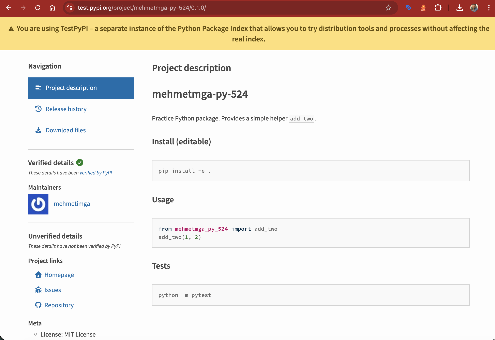

# mehmetmga-py-524

Practice Python package. Provides a simple helper `add_two`.

## Install (editable)

```bash
pip install -e .
```

## Usage

```python
from mehmetmga_py_524 import add_two
add_two(1, 2)
```

## Tests

```bash
python -m pytest
```

## TestPyPI

Published at https://test.pypi.org/project/mehmetmga-py-524/0.1.0/.



